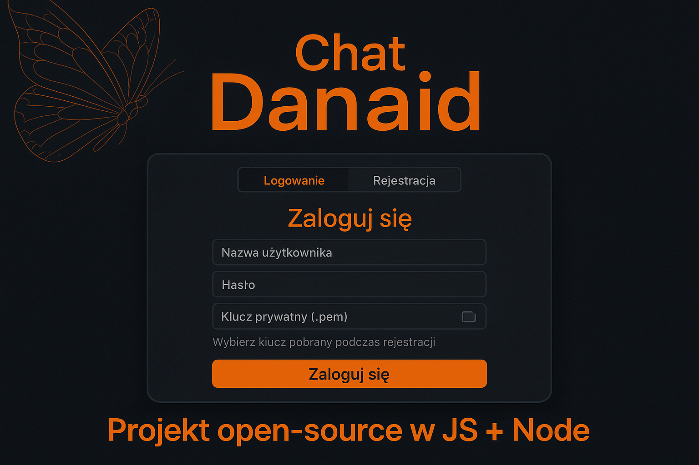

# Danaid Chat (local) – szyfrowany czat E2EE na Node.js

> Lokalny, edukacyjny komunikator typu „czat 1:1” z end‑to‑end encryption, oparty o **Node.js + Express** i pliki **JSON** jako bazę danych.  
> Projekt jest pomyślany jako playground do nauki kryptografii, bezpieczeństwa aplikacji i architektury protokołów w stylu Signal.

---

## 🎯 Cel projektu

Danaid Chat ma dwa główne cele:

1. **Techniczny / edukacyjny** – pokazać pełny flow:
   - rejestracja z dowodem posiadania klucza prywatnego,
   - logowanie oparte o PBKDF2 + challenge–response,
   - dodawanie znajomych,
   - szyfrowanie wiadomości (E2EE) i rozwój w stronę modelu podobnego do Signal (X3DH + Double Ratchet).
2. **Praktyczny** – dać prosty, uruchamialny lokalnie czat, który:
   - działa w sieci lokalnej (LAN),
   - nie wymaga zewnętrznej bazy danych (wszystko w JSON),
   - jest czytelny w kodzie i łatwy do modyfikacji.

---

## 🧱 Stos technologiczny

**Frontend**

- Czysty **JavaScript** (bez frameworków)
- **HTML + CSS**
- Web Crypto API po stronie przeglądarki (generowanie kluczy, PBKDF2, AES‑GCM)
- Widoki:
  - `login.html` – logowanie,
  - `chat.html` – główny interfejs czatu.

**Backend**

- **Node.js** (ES Modules)
- **Express** – API REST
- **JSON** jako „baza danych” (pliki na dysku):
  - `backend/db/users/*.json` – użytkownicy,
  - `backend/db/conversations/*.json` – konwersacje,
  - `backend/db/users_list.json` – lista loginów.
- **jsonwebtoken** – JWT do sesji
- **dotenv** – konfiguracja przez `.env`
- **HTTPS** na `https://chat.danaid:8443` z lokalnym certyfikatem (mkcert / własne CA)

---

## 📁 Struktura projektu

Główne katalogi w repozytorium:

```text
backend/
  app.js               # konfiguracja Express + routing
  server-https.js      # start serwera HTTPS
  routes/              # endpointy API (register, login, friends, messages, users)
  middleware/          # middleware (np. auth z JWT)
  security/            # challenge store, weryfikacja podpisów itd.
  utils/               # narzędzia: pliki, crypto, tokeny
  db/
    users/             # JSON-y poszczególnych użytkowników
    conversations/     # JSON-y konwersacji 1:1
    users_list.json    # globalna lista użytkowników

frontend/
  login.html / login.css / login.js
  chat.html  / chat.css  / chat.js
  signal_crypto.js      # warstwa E2EE (dev/prod roadmap)
  form-tabs.js, console.js, assets...

.env                    # konfiguracja (JWT_SECRET itp.)
package.json            # zależności Node.js
package-lock.json
```

---

## 🚀 Jak uruchomić projekt lokalnie

### 1. Wymagania

- **Node.js** w miarę świeża wersja (zalecane ≥ 18)
- **npm** (w zestawie z Node)
- System, na którym możesz:
  - dodać wpis do pliku `hosts`,
  - zainstalować lokalny certyfikat (np. za pomocą `mkcert`).

### 2. Klonowanie repozytorium

```bash
git clone <adres_repozytorium.git>
cd <katalog_repozytorium>
```

(w repo root powinny być katalogi `backend/`, `frontend/`, `package.json`, `.env` itd.)

### 3. Instalacja zależności

```bash
npm install
```

### 4. Konfiguracja `.env`

W katalogu głównym projektu utwórz plik `.env` (lub użyj istniejącego) i ustaw przynajmniej:

```env
JWT_SECRET=jakis_mocny_losowy_klucz
```

W przyszłości możesz tu trzymać też inne rzeczy (np. PORT, ścieżki do katalogu danych itp.).

### 5. Konfiguracja hosta `chat.danaid`

Serwer HTTPS nasłuchuje na adresie:

- **host:** `chat.danaid`
- **port:** `8443`

Dodaj wpis do pliku `hosts`:

**Windows** – `C:\Windows\System32\drivers\etc\hosts`  
**Linux / macOS** – `/etc/hosts`

Dodaj linię:

```text
127.0.0.1   chat.danaid
```

### 6. Certyfikat HTTPS (lokalny)

W katalogu `backend/certs/` aplikacja spodziewa się:

- `chat.danaid-key.pem`
- `chat.danaid-cert.pem`

Jeśli repozytorium nie zawiera certów (nie powinno w wersji publicznej), wygeneruj je samodzielnie, np. używając **mkcert**:

1. Zainstaluj `mkcert` (zgodnie z instrukcją dla Twojego systemu).
2. W katalogu `backend/` utwórz podkatalog `certs/` (jeśli go nie ma).
3. W tym katalogu uruchom:

   ```bash
   mkcert chat.danaid
   ```

   To wygeneruje dwa pliki – `.key` i `.pem` (nazwy możesz dostosować, by pasowały do tego, co jest ustawione w `server-https.js`, albo zmienić ścieżki w samym pliku).

4. Upewnij się, że zainstalowałeś lokalny CA od mkcert, żeby przeglądarka ufała certyfikatowi. Jeżeli nie:
5. 
   ```bash
   mkcert -install
   ```
### 7. Start serwera HTTPS

Z katalogu głównego projektu:

```bash
node backend/server-https.js
```

Jeżeli wszystko jest poprawnie skonfigurowane, w konsoli zobaczysz coś w stylu:

```text
[HTTPS] Serwer działa na https://chat.danaid:8443/login.html
```

### 8. Wejście do aplikacji

Otwórz w przeglądarce:

```text
https://chat.danaid:8443/login.html
```

> Uwaga: to adres **HTTPS**, więc jeśli certyfikat nie jest poprawnie zainstalowany / zaufany, przeglądarka może wyświetlać ostrzeżenia.

---

## 🧪 Aktualny stan projektu

Na dzień backupu:

- działają:
  - **rejestracja** (zapis użytkownika w JSON, PBKDF2 + sól, serverSignature nad rekordem),
  - **logowanie** (challenge–response, PBKDF2 po stronie klienta, podpis kluczem prywatnym, JWT),
  - **dodawanie znajomych** (dwustronna relacja, zapis publicznych kluczy znajomych),
  - frontend czatu (chat.html + chat.js) i warstwa szyfrowania (signal_crypto.js) są w trakcie przebudowy.
    - Aktualnie dostępny jest symetryczny chain-ratchet (wersja DEV), a kolejne etapy obejmują:
      
      - wprowadzenie identity keypair na użytkownika,
      - publikowanie prekey bundle w pliku użytkownika,
      - handshake X3DH-lite do wyliczania prawdziwego initial rootKey,
      - rozszerzenie ratchetowania do pełnego Double Ratchet (DH-ratchet + chain-ratchety), zgodnie z modelem Signal.

Szczegółowe opisy dla devów znajdziesz w osobnych plikach dokumentacji:

- [register_dev.md](register_dev.md)
- [login_dev.md](login_dev.md)
- [friends_dev.md](friends_dev.md)
- [messages_dev.md](messages_dev.md) 

---

## 🛠️ Dalszy rozwój

Plan przejścia z DEV E2EE → PROD E2EE (w stylu Signal) jest opisany w:

- `danaid_e2ee_roadmap.md`

Główne kierunki:

- Identity Keys + Prekey Bundle
- X3DH-lite jako źródło prawdziwego `rootKey`
- pełny Double Ratchet z DH‑ratchetami
- obsługa wiadomości poza kolejnością, migracje JSON
- hardening backendu (walidacja, rate limiting, ochrona plików, JWT)

---

## 📜 Licencja

Projekt jako **kod edukacyjny** do własnych eksperymentów z kryptografią i bezpieczeństwem.


